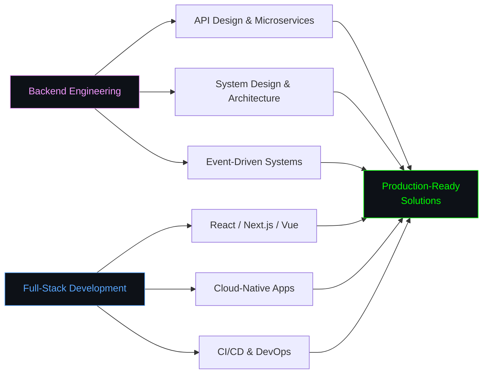
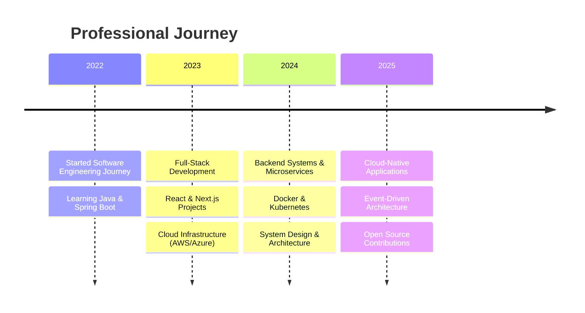

<div align="center">


</div>

<div align="center">

<h1>Cong Thanh Phan</h1>


<picture>
  <source media="(prefers-color-scheme: dark)" srcset="https://raw.githubusercontent.com/thanhphan20/thanhphan20/output/github-contribution-grid-snake-dark.svg"/>
  
</picture>

</div>


```python
class CongThanhPhan:
    def __init__(self):
        self.name = "Cong Thanh Phan"
        self.role = ["Software Engineer", "Backend Focus"]
        self.interests = ["Cloud & System Design", "Full-Stack Development"]
        self.location = "Vietnam"

    def tech(self):
        return {
            "languages": ["TypeScript", "JavaScript", "Python", "Java", "C#", "Go", "Rust", "PHP"],
            "backend": ["Spring Boot", "NestJS", ".NET", "Node.js", "Express.js", "Laravel"],
            "frontend": ["React", "Next.js", "Vue.js", "Angular", "Tailwind CSS"],
            "databases": ["PostgreSQL", "MongoDB", "MySQL", "Redis", "Firebase"],
            "cloud": ["AWS", "Azure", "GCP"],
            "devops": ["Docker", "Kubernetes", "Terraform", "GitHub Actions", "Jenkins"],
        }

me = CongThanhPhan()
```

```
Software engineer focused on full-stack development and cloud-native systems.
Currently exploring AWS/Azure infrastructure and system design, always happy
to collaborate on interesting open-source work.
```


### Tech Stack

#### Languages


#### Frontend


#### Backend


#### Database & Cloud


#### DevOps & Tools


#### Testing


<div align="center">

## Focus Areas

</div>




<div align="center">

## Experience

</div>




<div align="center">

<picture>
  <source media="(prefers-color-scheme: dark)" srcset="https://github-readme-activity-graph.vercel.app/graph?username=thanhphan20&theme=tokyo-night&hide_border=true&bg_color=0D1117&color=F398FF&line=F398FF&point=58A6FF&area=true"/>
  
</picture>

<picture>
  <source media="(prefers-color-scheme: dark)" srcset="https://github-readme-stats.vercel.app/api?username=thanhphan20&show_icons=true&include_all_commits=true&count_private=true&theme=tokyonight&hide_border=true&bg_color=0D1117&title_color=F398FF&text_color=FFFFFF&icon_color=58A6FF"/>
  
</picture>
<picture>
  <source media="(prefers-color-scheme: dark)" srcset="https://github-readme-stats.vercel.app/api/top-langs/?username=thanhphan20&layout=compact&theme=tokyonight&hide_border=true&bg_color=0D1117&title_color=F398FF&text_color=FFFFFF&langs_count=10"/>
  
</picture>

</div>


<div align="center">

<i>"Building scalable systems and clean architectures — one commit at a time."</i>

<br><br>

[](https://www.linkedin.com/in/c%C3%B4ng-th%C3%A0nh-phan-05a7b7237/)
[](mailto:thanhphandev20@gmail.com)
[](https://www.facebook.com/ctp.congthanhphan/)

<br>


</div>
