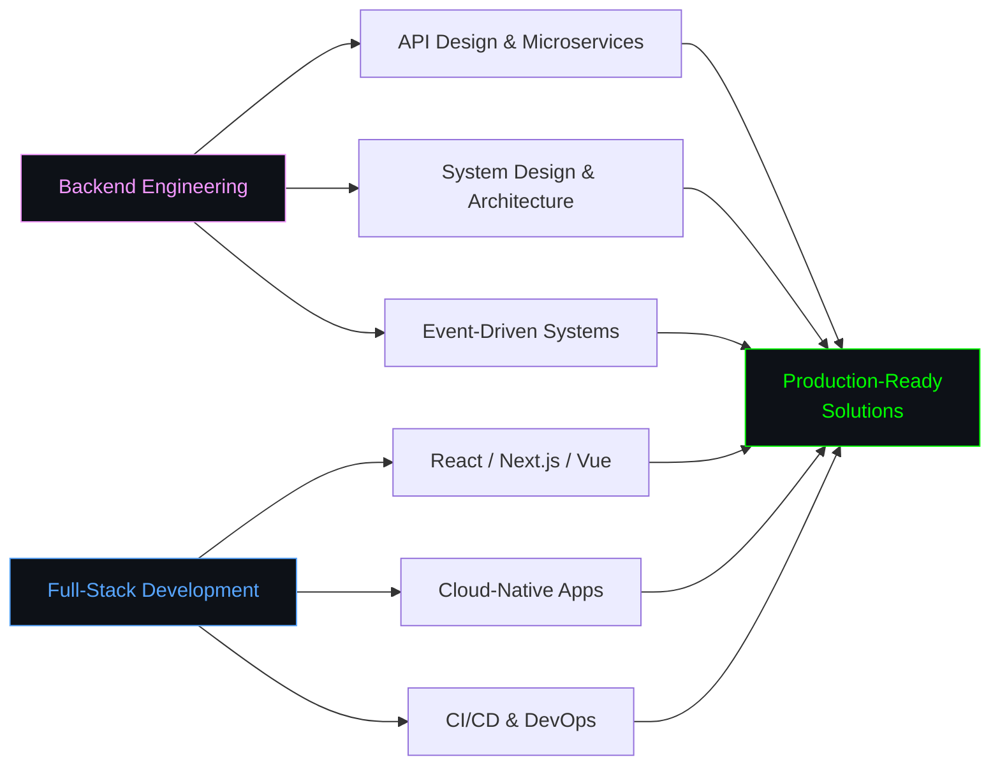
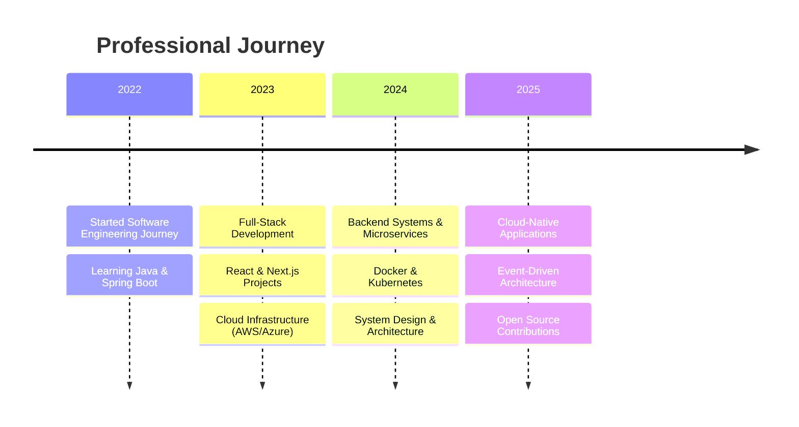

<div align="center">


<h1>Cong Thanh Phan</h1>


<picture>
  <source media="(prefers-color-scheme: dark)" srcset="https://raw.githubusercontent.com/thanhphan20/thanhphan20/output/github-contribution-grid-snake-dark.svg"/>
  
</picture>

</div>


```python
class CongThanhPhan:
    def __init__(self):
        self.name = "Cong Thanh Phan"
        self.role = ["Software Engineer", "Backend Focus"]
        self.interests = ["Cloud & System Design", "Full-Stack Development"]
        self.location = "Vietnam"

    def tech(self):
        return {
            "languages": ["TypeScript", "JavaScript", "Python", "Java", "C#", "Go", "Rust", "PHP"],
            "backend": ["Spring Boot", "NestJS", ".NET", "Node.js", "Express.js", "Laravel"],
            "frontend": ["React", "Next.js", "Vue.js", "Angular", "Tailwind CSS"],
            "databases": ["PostgreSQL", "MongoDB", "MySQL", "Redis", "Firebase"],
            "cloud": ["AWS", "Azure", "GCP"],
            "devops": ["Docker", "Kubernetes", "Terraform", "GitHub Actions", "Jenkins"],
        }

me = CongThanhPhan()
```

```
Software engineer focused on full-stack development and cloud-native systems.
Currently exploring AWS/Azure infrastructure and system design, always happy
to collaborate on interesting open-source work.
```


<div align="center">

## Tech Stack


<br>

<br>

<br>

<br>


</div>


<div align="center">

## Focus Areas

</div>




<div align="center">

## Experience

</div>




<div align="center">

## Open to Collaboration

<table width="100%">
<tr>
<td align="center" width="20%">
<picture>
  <source media="(prefers-color-scheme: dark)" srcset="https://api.iconify.design/mdi/code-braces-box.svg?color=white">
  <source media="(prefers-color-scheme: light)" srcset="https://api.iconify.design/mdi/code-braces-box.svg?color=black">
  
</picture>
<br><br>
<strong>Backend Systems</strong>
<br><br>
<small>
Java & Spring Boot<br>
NestJS & .NET<br>
gRPC & GraphQL
</small>
</td>
<td align="center" width="20%">
<picture>
  <source media="(prefers-color-scheme: dark)" srcset="https://api.iconify.design/mdi/cloud-outline.svg?color=white">
  <source media="(prefers-color-scheme: light)" srcset="https://api.iconify.design/mdi/cloud-outline.svg?color=black">
  
</picture>
<br><br>
<strong>Cloud & DevOps</strong>
<br><br>
<small>
AWS / Azure / GCP<br>
Docker & Kubernetes<br>
Terraform & CI/CD
</small>
</td>
<td align="center" width="20%">
<picture>
  <source media="(prefers-color-scheme: dark)" srcset="https://api.iconify.design/mdi/monitor-dashboard.svg?color=white">
  <source media="(prefers-color-scheme: light)" srcset="https://api.iconify.design/mdi/monitor-dashboard.svg?color=black">
  
</picture>
<br><br>
<strong>Full-Stack Apps</strong>
<br><br>
<small>
React & Next.js<br>
Vue.js & Angular<br>
Responsive UI
</small>
</td>
<td align="center" width="20%">
<picture>
  <source media="(prefers-color-scheme: dark)" srcset="https://api.iconify.design/mdi/database-cog-outline.svg?color=white">
  <source media="(prefers-color-scheme: light)" srcset="https://api.iconify.design/mdi/database-cog-outline.svg?color=black">
  
</picture>
<br><br>
<strong>Data & Messaging</strong>
<br><br>
<small>
PostgreSQL & MongoDB<br>
Redis & Kafka<br>
RabbitMQ
</small>
</td>
<td align="center" width="20%">
<picture>
  <source media="(prefers-color-scheme: dark)" srcset="https://api.iconify.design/mdi/open-source-initiative.svg?color=white">
  <source media="(prefers-color-scheme: light)" srcset="https://api.iconify.design/mdi/open-source-initiative.svg?color=black">
  
</picture>
<br><br>
<strong>Open Source</strong>
<br><br>
<small>
Community Projects<br>
Code Review<br>
Developer Tooling
</small>
</td>
</tr>
</table>

</div>


<div align="center">

<picture>
  <source media="(prefers-color-scheme: dark)" srcset="https://github-readme-activity-graph.vercel.app/graph?username=thanhphan20&theme=tokyo-night&hide_border=true&bg_color=0D1117&color=F398FF&line=F398FF&point=58A6FF&area=true"/>
  
</picture>

<picture>
  <source media="(prefers-color-scheme: dark)" srcset="https://github-readme-stats.vercel.app/api?username=thanhphan20&show_icons=true&include_all_commits=true&count_private=true&theme=tokyonight&hide_border=true&bg_color=0D1117&title_color=F398FF&text_color=FFFFFF&icon_color=58A6FF"/>
  
</picture>
<picture>
  <source media="(prefers-color-scheme: dark)" srcset="https://github-readme-stats.vercel.app/api/top-langs/?username=thanhphan20&layout=compact&theme=tokyonight&hide_border=true&bg_color=0D1117&title_color=F398FF&text_color=FFFFFF&langs_count=10"/>
  
</picture>

</div>


<div align="center">

<i>"Building scalable systems and clean architectures — one commit at a time."</i>

<br><br>

[](https://www.linkedin.com/in/c%C3%B4ng-th%C3%A0nh-phan-05a7b7237/)
[](mailto:thanhphandev20@gmail.com)
[](https://www.facebook.com/ctp.congthanhphan/)

<br>


</div>
